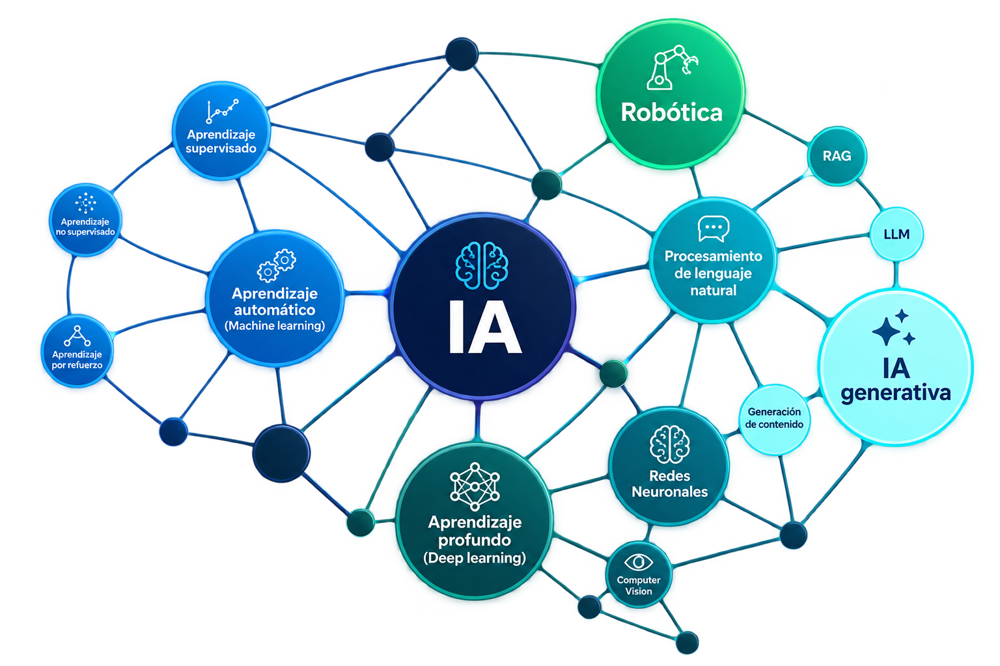
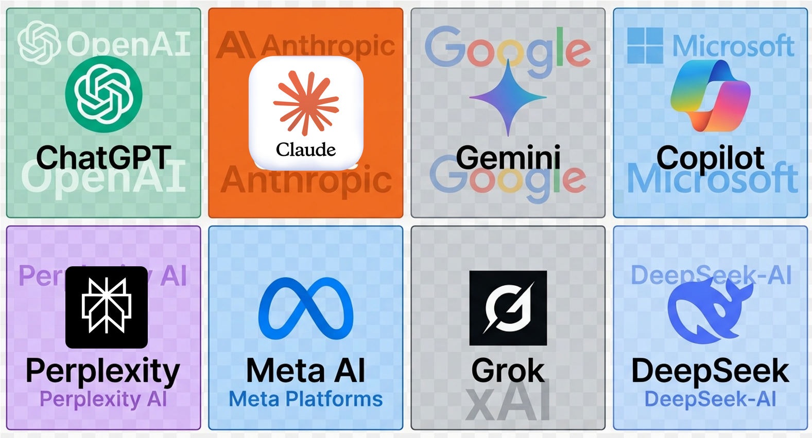
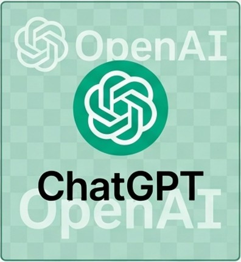
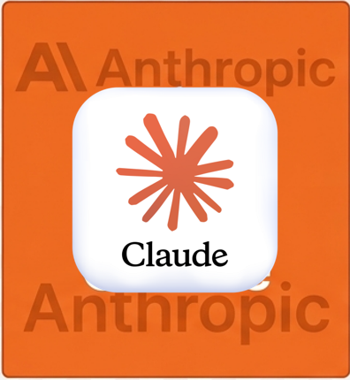
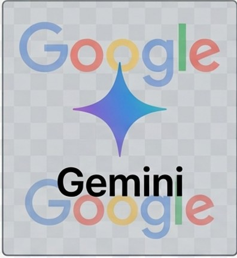
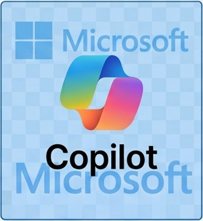
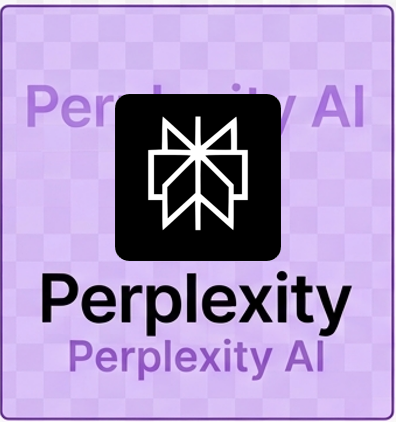
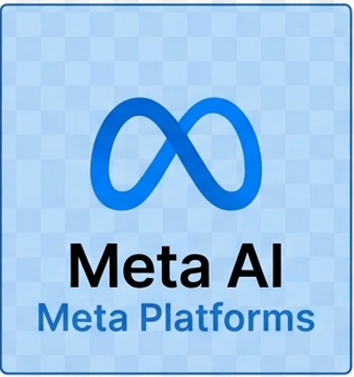
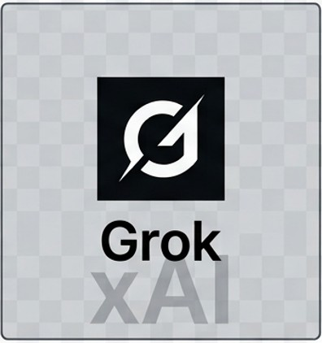
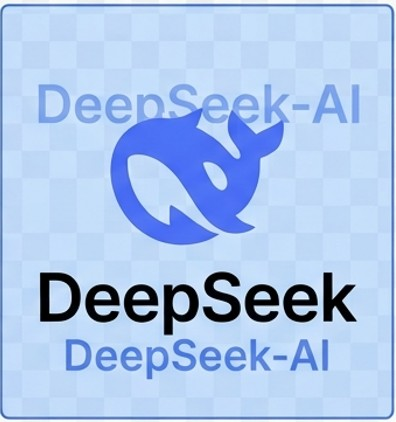

# Repaso {#sec-repaso}

No toda la IA es un chatbot. Bajo el paraguas de la IA conviven enfoques distintos que resuelven problemas distintos.

{fig-align="center" width="35%"}

- La **IA generativa** predice la continuación más plausible de un texto.
- Su corpus de entrenamiento **no es una base de datos**: la respuesta se genera, no se recupera.
- Problemas comunes: falta de mecanismos para reconocer sus propios límites, alucinaciones en preguntas de nicho.

> **La IA generativa propone; quien la usa valida.**

# El mercado {#sec-mercado}

## Un puñado de empresas

{fig-align="center" width="50%"}

- Cuatro grandes desarrolladores estadounidenses concentran el mercado consumer: **OpenAI**, **Anthropic**, **Google**, **Microsoft**.
- Jugadores especializados: **Perplexity** (búsqueda con citas), **Meta** (integrado en WhatsApp, IG, Facebook), **xAI** (Grok).
- Contrapesos geopolíticos: **DeepSeek** (China), **Mistral** (Francia).

## No es casualidad

Que casi todo el mercado consumer esté concentrado en EE.UU., con China como contrapeso y Europa como tercer polo pequeño, refleja:

- Dónde está el capital.
- Dónde están las universidades más grandes.
- Dónde se están tomando las decisiones políticas y militares que en los últimos dos años empezaron a moldear el sector.

> Elegir una herramienta ya no es una decisión solamente técnica.

# Recorrido por herramienta {#sec-recorrido}

## ChatGPT (OpenAI)

:::: {.columns}
::: {.column width="30%"}
{fig-align="center"}
:::
::: {.column width="70%"}
- Empresa que abrió el mercado consumer **a fines de 2022**.
- [Planes](https://chatgpt.com/es-419/pricing/): Free / Go / Plus / Pro / Team / Enterprise.
- Los planes distinguen por *cantidad de mensajes con los modelos más potentes*, acceso a modelos de razonamiento, generación de imagen/video, agentes.
- **Destaca en**: razonamiento matemático y lógico, agentes autónomos, amplitud de ecosistema.
- **Debilidades**: verbosidad, variabilidad de calidad entre modelos.
:::
::::

## Claude (Anthropic)

:::: {.columns}
::: {.column width="30%"}
{fig-align="center"}
:::
::: {.column width="70%"}
- Fundada por ex-integrantes de OpenAI; postura más conservadora en materia de seguridad.
- [Planes](https://claude.com/es/pricing): Free / Pro / Max / Team / Enterprise.
- **Destaca en**: escritura extensa, análisis de documentos largos, programación.
- Estilo más natural, menos formulaico.
- **Debilidades**: integración con la web más limitada, menos plugins.
:::
::::

## Gemini (Google)

:::: {.columns}
::: {.column width="30%"}
{fig-align="center"}
:::
::: {.column width="70%"}
- Forma parte de una oferta integrada al ecosistema Google (Gmail, Drive, Docs, YouTube).
- [Planes](https://one.google.com/intl/es-419_cl/about/google-ai-plans/): Free / AI Plus / AI Pro / Ultra.
- **Destaca en**: contexto muy largo (libros enteros, horas de audio y video), análisis multimodal.
- Integración nativa con herramientas Google.
- **Debilidad**: rendía por detrás en razonamiento puro, la brecha se ha ido acortando.
:::
::::

## Copilot (Microsoft)

:::: {.columns}
::: {.column width="30%"}
{fig-align="center"}
:::
::: {.column width="70%"}
- Asistente integrado a Windows y a Office (Word, Excel, PowerPoint, Outlook).
- Motor: en gran medida modelos de OpenAI + desarrollos propios.
- [Planes](https://www.microsoft.com/es-cl/microsoft-365-copilot/pricing/individuals): Free / M365 personal / M365 Premium / M365 Pro.
- **Destaca en**: trabajo dentro del ecosistema Microsoft (fórmulas Excel, resúmenes Word, armado de PPT).
- **Debilidad**: fuera de Office pierde su ventaja competitiva.
:::
::::

## Perplexity

:::: {.columns}
::: {.column width="30%"}
{fig-align="center"}
:::
::: {.column width="70%"}
- Nicho específico: **no es un chatbot generalista, es un buscador potenciado por IA**.
- Cada respuesta viene con enlaces a fuentes.
- [Planes](https://www.perplexity.ai/es/hub/pricing): Free / Pro / Max.
- **Destaca en**: investigación con citas verificables.
- **Debilidad crítica**: demandas activas de editores (NYT, WSJ, Chicago Tribune, Nikkei) por uso no autorizado de contenidos. Que aparezca una cita no significa que la información esté ahí.
:::
::::

<!-- Fuente NYT vs Perplexity: https://www.courthousenews.com/new-york-times-joins-copyright-fight-against-ai-startup-perplexity/ -->

## Meta AI (WhatsApp e Instagram)

:::: {.columns}
::: {.column width="30%"}
{fig-align="center"}
:::
::: {.column width="70%"}
- Integrado directamente en WhatsApp, Instagram y Facebook. No requiere aplicación adicional.
- [Planes de pago](https://www.meta.com/es-la/meta-one-plans/): enfocados en uso de la IA dentro de sus aplicaciones.
- Modelos (familia Llama) más débiles que la frontera actual en tareas técnicas complejas.
- **Destaca en**: comodidad, transformar notas de voz/texto en terreno sin salir de WhatsApp.
- **Debilidad crítica**: las conversaciones con Meta AI **no siguen las mismas reglas de privacidad** que un chat normal de WhatsApp.
:::
::::

## Grok (xAI)

:::: {.columns}
::: {.column width="30%"}
{fig-align="center"}
:::
::: {.column width="70%"}
- Empresa de Elon Musk. Disponible como app y dentro de X (ex-Twitter).
- Se posiciona explícitamente como alternativa "menos filtrada".
- No destaca en ninguno de los objetivos concretos del curso.
- **Arrastra controversias importantes** (se ven en el bloque final).
- Mención para reconocimiento, no como herramienta de trabajo profesional.
:::
::::

## DeepSeek

:::: {.columns}
::: {.column width="30%"}
{fig-align="center"}
:::
::: {.column width="70%"}
- Empresa china que a principios de 2025 sorprendió con modelos competitivos a fracción del costo.
- **Dos problemas críticos para uso profesional**:
  - Datos almacenados en servidores en China; legislación china obliga a entregar información cuando el gobierno la solicite.
  - **Censura hardcodeada** sobre temas sensibles al gobierno chino (Taiwán, Tiananmen, Xinjiang).
- Prohibido en dispositivos oficiales en Italia, Australia, Taiwán, Corea del Sur, Alemania, República Checa.
:::
::::

<!-- Fuente DeepSeek prohibiciones: https://techcrunch.com/2025/02/03/deepseek-the-countries-and-agencies-that-have-banned-the-ai-companys-tech -->

## Mistral (mención)

- Empresa francesa; alternativa europea.
- Mejor postura de privacidad al estar sujeta a **GDPR**.
- Modelos competentes aunque no lideran los rankings de rendimiento.
- Opción a explorar para quien priorice el eje de privacidad y jurisdicción europea.

# La elección {#sec-eleccion}

## Nueve nombres, tres objetivos

Con nueve nombres sobre la mesa la pregunta útil no es "cuál es la mejor" sino **"cuál conviene para qué"**.

Los tres objetivos que planteamos al inicio del curso ordenan la decisión:

1. Investigar y discutir metodologías estadísticas.
2. Elaborar reportes desde notas dispersas de terreno.
3. Automatizar procesos en Excel, eventualmente con R.

## Objetivo 1 — Investigación metodológica

- **Claude o ChatGPT** para conversación técnica profunda (mejor calidad de razonamiento).
- **Perplexity** como complemento porque agrega el paso de citar fuentes.
- Precaución: siempre revisar que la cita realmente diga lo que se afirma.

> Se retoma en la sesión 5, con herramientas académicas específicas.

## Objetivo 2 — Reportes desde notas de terreno

- **Claude y ChatGPT** integran chat de voz en interfaz web y móvil; **ChatGPT** tiene mejor desempeño con el español.
- **Gemini Live** disponible solo en dispositivos móviles.
- Opción cómoda: seguir dictando en WhatsApp con Meta AI, con la conciencia de sus advertencias de privacidad.

> Se retoma en la sesión 4, sobre trabajo con documentos propios.

## Objetivo 3 — Automatización de Excel / R

- **Copilot** dentro de Excel para tareas rutinarias.
- **Claude o ChatGPT** para pedir código R cuando la tarea escala.

> Se retoma en la sesión 7.

# Factores ético-políticos {#sec-etico-politico}

Elegir una herramienta de IA implica, aunque no se quiera, alinearse con la postura política y comercial de una empresa.

> La información en esta sección son hechos verificables (contratos públicos, cartas del Congreso, reportajes periodísticos). Las conclusiones son de cada quien.

*Actualizado al 20 de septiembre de 2026.*

## Contratos con el Pentágono

- **Julio 2025**: el DoD firmó contratos de hasta USD 200M cada uno con OpenAI, Anthropic, Google y xAI para desarrollo de capacidades de IA militares y de seguridad.
- Iniciativa GSA: ChatGPT, Claude, Gemini, Grok y Perplexity licenciados a agencias federales por sumas simbólicas.
- **2026**: administración Trump presionó a Anthropic para reducir sus safeguards.
  - Anthropic se negó.
  - Trump firmó orden ejecutiva descontinuando el uso de Claude en agencias federales.
- **Mayo 2026**: ocho empresas firmaron con el DoD para redes clasificadas del Pentágono; **Anthropic quedó fuera**.

> Todas las grandes tienen algún vínculo comercial con el aparato militar de EE.UU. El matiz está en las condiciones que aceptan.

<!-- Fuente contratos DoD $200M: https://fortune.com/2025/07/14/elon-musk-doge-cuts-federal-contracts-xai-grok-for-government-200-million-contract-defense-department -->
<!-- Fuente Grok MechaHitler y contrato Pentágono: https://www.newsweek.com/elon-musks-controversial-grok-ai-lands-contract-pentagon-2098771 -->

## Relación con la administración Trump

- **Musk**: jefe de DOGE (recorte de gasto federal). En paralelo, xAI ganó el contrato de USD 200M con el Pentágono.
- **Donaciones al fondo inaugural de Trump** (dic 2024 – ene 2025): USD 1M cada uno de Meta, Amazon, Google, Microsoft y Sam Altman a título personal.
  - Práctica estándar en el cambio de mando, pero Trump estableció récord: **USD 170M** vs USD 63M de Biden cuatro años antes.
- **Agosto 2026**: Zuckerberg conversó en privado con Trump sobre la propuesta de organismo nacional de regulación de IA; se opuso, defendió enfoque regulatorio ligero.
- **Septiembre 2026**: Zuckerberg defendió que las empresas de IA tienen incentivos suficientes para desarrollar IA de forma segura sin una desaceleración coordinada — en contra de las posturas de Anthropic y OpenAI.

<!-- Fuente Zuckerberg-Trump llamada regulador: https://shattered.io/zuckerberg-trump-ai-regulator-call-2026/ -->
<!-- Fuente Zuckerberg alineación con Trump en debate AI safety: https://news4jax.com/business/2026/09/16/zuckerberg-distances-meta-from-calls-for-a-coordinated-approach-on-an-ai-slowdown -->

> Hay grados: algunos ejecutivos son aliados políticos activos, otros mantienen distancia pública mientras cierran los mismos contratos.

## Operaciones militares israelíes

- **Google y Amazon**: contrato de USD 1.200M con el gobierno de Israel (Project Nimbus, 2021) para nube e IA, incluyendo Ministerio de Defensa. Trabajadores de Google que protestaron fueron **despedidos en 2024**.
- **Microsoft**: contratos con las Fuerzas de Defensa de Israel (IDF). Tras un reportaje del [Guardian](https://www.theguardian.com/us-news/2025/oct/29/google-amazon-israel-contract-secret-code), en septiembre de 2025 cortó parte de esos servicios (no todos).
- **OpenAI**: en enero de 2024 modificó su política de uso para permitir aplicaciones militares (previamente prohibidas). Anunció después su contrato con el Pentágono. La política actual continúa prohibiendo determinados usos (armas y ciertos usos de seguridad nacional).

> Es el eje donde más información nueva aparece, en buena parte por trabajo periodístico sostenido y filtraciones de empleados.

## Datos, jurisdicción y propiedad intelectual

- Las herramientas estadounidenses operan bajo ley estadounidense; también obliga a entregar información bajo órdenes judiciales. La diferencia está en marcos de protección y retención.
- **DeepSeek**: datos en China; gobierno chino entre sus principales inversionistas. Restricciones en varios países por seguridad nacional y protección de datos.
- **Perplexity**: demandas por copyright por scraping no autorizado, incluyendo material tras muros de pago.
- **Meta**: agosto 2026, el Congreso de EE.UU. impulsó investigación por delegar en IA la moderación de contenido y detección de deepfakes de cara a los *midterms* 2026.

> Debate abierto: **Modelos propietarios vs código abierto**. Llama (Meta) o DeepSeek permiten descarga local — soberanía sobre datos, pero abre el debate sobre control posterior de usos maliciosos.

<!-- Fuente DeepSeek riesgos privacidad y bans: https://techjacksolutions.com/ai-tools/deepseek/deepseek-security-and-privacy-risks/ -->
<!-- Fuente carta Congreso a Meta rollback safeguards: https://kevinmullin.house.gov/wp-content/uploads/2026/08/Meta-Election-Integrity-Letter-8.17.26.pdf -->
<!-- Fuente Perplexity demandas múltiples de editores: https://pressgazette.co.uk/platforms/news-publisher-ai-deals-lawsuits-openai-google/ -->

# Resumen {#sec-resumen}

## Tabla comparativa

| Herramienta | Empresa (país) | Planes | Fortaleza | Debilidad |
|---|---|---|---|---|
| **ChatGPT** | OpenAI (EE.UU.) | Free / Go / Plus / Pro | Razonamiento, agentes, ecosistema, imágenes | Verbosidad, variabilidad |
| **Claude** | Anthropic (EE.UU.) | Free / Pro / Max | Texto largo, código, documentos | Web limitada, no genera imágenes |
| **Gemini** | Google (EE.UU.) | Free / AI Plus / AI Pro / Ultra | Contexto largo, multimodal, integra Google | Razonamiento por detrás |
| **Copilot** | Microsoft (EE.UU.) | Free / M365 personal / Premium / Pro | Integración Office y Windows | Fuera de Office pierde ventaja |
| **Perplexity** | Perplexity AI (EE.UU.) | Free / Pro / Max | Búsqueda con citas | Legitimidad de citas cuestionada |
| **Meta AI** | Meta (EE.UU.) | Gratis en WhatsApp/IG/FB | Comodidad, integrado | Privacidad distinta al chat normal |
| **Grok** | xAI (EE.UU.) | Free / X Premium+ / SuperGrok | (no destaca) | Controversias éticas |
| **DeepSeek** | DeepSeek (China) | Gratis / API barata | Bajo costo | Datos en China, censura |
| **Mistral** | Mistral AI (Francia) | Free / Pro / Team | Jurisdicción europea (GDPR) | Rendimiento no lidera |

## Para llevarse

- No hay una herramienta buena ni una mala. Hay **compromisos** que cada usuario equilibra según sus prioridades:
  - comodidad de uso,
  - calidad técnica,
  - costo,
  - privacidad,
  - postura política de la empresa detrás.

- Decisión práctica sensata: **elegir dos herramientas complementarias en vez de una**.
  - Un chatbot de trabajo principal (Claude o ChatGPT, según preferencia de estilo).
  - Un especializado para búsqueda con citas verificables (Perplexity, con la reserva señalada).

> **La herramienta que se elija importa menos que aprender a conversar bien con ella.**  
> De eso trata la próxima sesión.

<!-- ============================================================ -->
<!-- FUENTES CONSULTADAS (verificadas septiembre 2026):             -->
<!-- 1. Contratos $200M DoD con OpenAI/Anthropic/Google/xAI:         -->
<!--    https://fortune.com/2025/07/14/elon-musk-doge-cuts-federal-contracts-xai-grok-for-government-200-million-contract-defense-department -->
<!-- 2. Grok MechaHitler y contrato Pentágono:                       -->
<!--    https://www.newsweek.com/elon-musks-controversial-grok-ai-lands-contract-pentagon-2098771 -->
<!-- 3. Grok GSA deal $0.42 por agencia:                             -->
<!--    https://www.tomshardware.com/tech-industry/artificial-intelligence/elon-musks-grok-ai-to-be-used-by-us-government-at-a-price-of-42-cents-per-agency-trump-admin-joining-meta-openai-in-recent-trend-of-ai-govt-contracts -->
<!-- 4. Zuckerberg-Trump llamada privada regulador AI:               -->
<!--    https://shattered.io/zuckerberg-trump-ai-regulator-call-2026/ -->
<!-- 5. Carta Congreso a Meta por rollback de safeguards:            -->
<!--    https://kevinmullin.house.gov/wp-content/uploads/2026/08/Meta-Election-Integrity-Letter-8.17.26.pdf -->
<!-- 6. Zuckerberg alineación con Trump en debate AI safety:         -->
<!--    https://news4jax.com/business/2026/09/16/zuckerberg-distances-meta-from-calls-for-a-coordinated-approach-on-an-ai-slowdown -->
<!-- 7. DeepSeek prohibiciones en gobiernos:                         -->
<!--    https://techcrunch.com/2025/02/03/deepseek-the-countries-and-agencies-that-have-banned-the-ai-companys-tech -->
<!-- 8. DeepSeek riesgos privacidad y censura documentada:           -->
<!--    https://techjacksolutions.com/ai-tools/deepseek/deepseek-security-and-privacy-risks/ -->
<!-- 9. NYT demanda a Perplexity por copyright:                      -->
<!--    https://www.courthousenews.com/new-york-times-joins-copyright-fight-against-ai-startup-perplexity/ -->
<!-- 10. Perplexity demandas múltiples de editores:                  -->
<!--     https://pressgazette.co.uk/platforms/news-publisher-ai-deals-lawsuits-openai-google/ -->
<!-- 11. Guardian - Microsoft y Google/Amazon en Israel:             -->
<!--     https://www.theguardian.com/us-news/2025/oct/29/google-amazon-israel-contract-secret-code -->
<!-- ============================================================ -->
